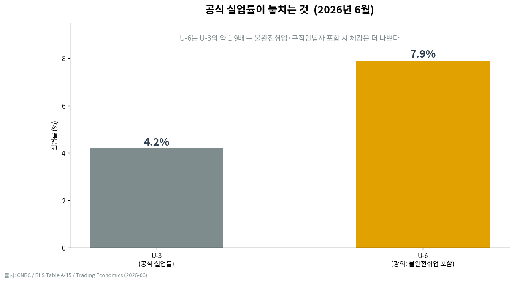
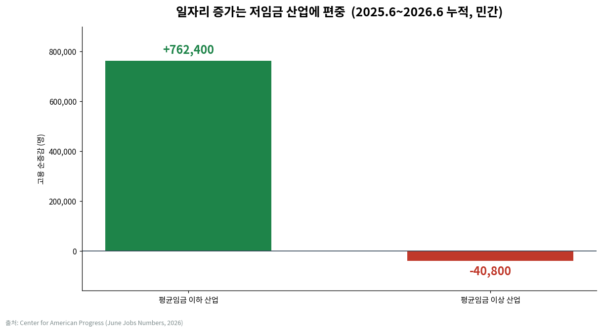
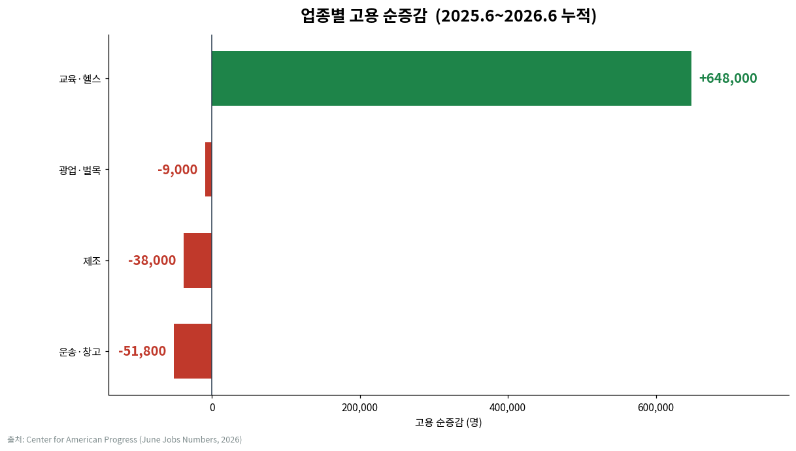
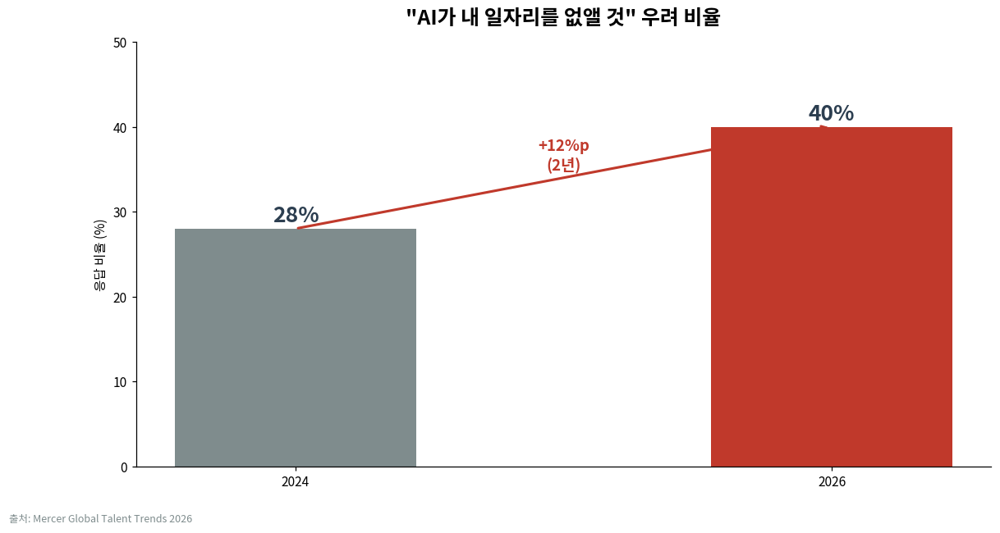
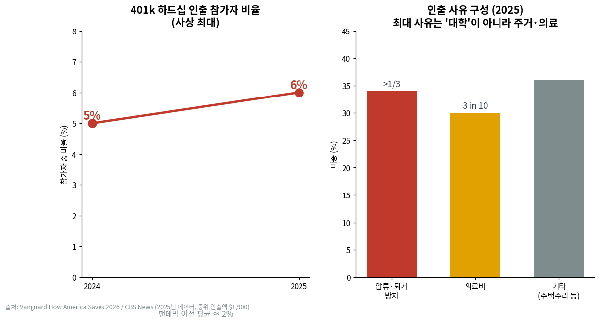

# "고용 불안 완화"라는 착시 — 노동시장 건전성을 뜯어보다

> 네이버 블로그 3부작 中 [2편]. 투자·금융 관심 독자 대상. 수치는 2026년 7월 초 기준 원출처 재확인분.

## 시장의 통념부터 의심해 보자

요즘 시장의 안도감은 대략 이런 삼단논법 위에 서 있다. "실업률은 4.2%로 여전히 낮다 → 노동시장이 튼튼하다 → 그러니 AI가 일자리를 대체한다는 불안은 과장이다." 지표 하나하나는 틀리지 않았다. 그런데 이 논리를 그대로 믿고 포지션을 잡기 전에, 헤드라인 숫자 **안쪽**을 열어볼 필요가 있다. 결론부터 말하면, 표면의 안정은 진짜지만 그 안에서 벌어지는 일 — 저임금 편중, 고용의 질 악화, 고임금·화이트칼라 부문의 지속적 감소 — 은 오히려 AI 대체 서사를 **반박이 아니라 검증**하는 쪽에 가깝다.

## 헤드라인은 왜 착시를 만드나

2026년 6월 고용보고서의 표면 숫자는 이렇다. 비농업 신규고용 **+5.7만 명**(다우존스 컨센서스 11.5만을 크게 하회), 실업률 **4.2%**. 실업률만 보면 견고하지만, 이 4.2%가 **떨어진** 이유가 문제다. 일자리가 늘어서가 아니라 **경제활동참가율이 61.5%로 0.3%p 급락**했기 때문이다. 2021년 3월 이후 최저치다. 구직을 아예 포기한 사람이 분모(경제활동인구)에서 빠지면 실업률은 기계적으로 내려간다. '좋은 이유로 낮아진 실업률'이 아니라는 뜻이다.

폭을 넓혀 보면 간극은 더 벌어진다. 불완전취업자·구직단념자까지 포함하는 광의 실업률 **U-6는 7.9%**로, 공식 실업률 U-3(4.2%)의 약 1.9배다. 원하는 만큼 일하지 못하는 사람, 일자리를 찾다 지쳐 통계에서 사라진 사람까지 세면 체감은 헤드라인보다 확실히 나쁘다. 구인 통계(JOLTS)도 5월 기준 **760만 건**으로 안정돼 보이지만, 채용률은 3.3%에 머물러 팬데믹 회복기 이후 가장 얼어붙은 수준이다. 자리는 있는데 실제 사람을 뽑지는 않는, 전형적인 '저채용·저해고(low-hire, low-fire)' 국면이다.

## 늘어난 일자리의 '구성'을 뜯어보면

핵심은 총량이 아니라 **어떤 일자리가 늘고 어떤 일자리가 줄었나**다. Center for American Progress 분석에 따르면, 2025년 6월 이후 1년간 민간에서 늘어난 일자리는 **평균임금 이하** 산업에 **+76만 2,400개**가 몰린 반면, **평균임금 이상** 산업은 오히려 **-4만 800개** 줄었다. 방향 자체가 반대다.

업종별로 쪼개면 그림은 더 선명하다. 같은 기간 순증의 대부분은 **민간 교육·헬스케어(+64만 8,000)** — 상대적으로 임금이 낮은 부문 — 가 끌고 갔다. 반대편에서는 **제조(-3만 8,000), 운송·창고(-5만 1,800), 광업·벌목(-9,000)** 같은 중임금·블루칼라 부문이 계속 일자리를 잃었다. 저임금 서비스가 채워 넣고 중·고임금 부문이 빠지는 구조. 실질임금이 뒷걸음질하는 국면에서 이런 구성 변화는 가계의 구매력을 지켜주지 못한다.

## AI 시그널: 완화가 아니라 '검증'

여기서 원래의 통념 — "노동지표가 괜찮으니 AI 불안은 과장" — 으로 돌아가 보자. 데이터는 정반대를 가리킨다. **정보·금융(information + financial activities)** 부문은 2026년 1~5월 동안 **월평균 약 2.8만 개**씩 일자리를 잃었다. 같은 기간 전체 노동시장이 월 11만 개 넘게 순증했다는 점과 대비하면, AI 노출도가 높은 화이트칼라 부문만 역주행하고 있는 셈이다. 정보 부문 고용은 2021년 3월 이후 최저로 내려앉으며 4년치 증가분을 반납했고, 16개월 연속 순감을 기록 중이다.

노동자들의 체감도 이를 따라간다. Mercer Global Talent Trends 조사에서 "AI가 내 일자리를 없앨 것"이라는 우려는 **2024년 28% → 2026년 40%**로, 2년 만에 12%p 뛰었다. 불안이 진정되는 게 아니라 **가속**되고 있다. 즉, 표면 지표의 안정이 AI 대체론을 잠재우는 게 아니라, 지표 내부의 화이트칼라 감소가 그 서사를 데이터로 뒷받침하고 있다.

## 가계로 번진 스트레스 — 다만 사실관계는 정확히

노동시장의 질 악화는 가계 재무로 흘러들었다. Vanguard 집계상 2025년에 401(k) **하드십(긴급) 인출**을 한 가입자 비율은 **6%**로 사상 최대였다(2024년 5%, 팬데믹 이전 평균 약 2%). 급전이 필요한 사람이 노후자금에 손을 대고 있다는 신호다.

여기서 흔히 도는 오해를 바로잡을 필요가 있다. 하드십 인출의 **최대 사유는 '대학 등록금'이 아니라 주거와 의료**다. 2025년 인출의 **3분의 1 이상이 주택 압류·퇴거(foreclosure/eviction) 방지**를 위한 것이었고, 두 번째가 **의료비(약 30%)**였다. 중위 인출액은 **$1,900** — 목돈 마련이 아니라 당장의 생계·주거를 막기 위한 소액 인출이라는 성격이 드러난다.

한 가지 시점(時點)은 분명히 해두자. **이 하드십 데이터는 2025년치**다. 2026년 들어 장기금리가 급등하며 주거비 부담이 커진 국면(3편에서 다룰 주제)과는 **시차**가 있다. 2025년의 인출 급증이 곧바로 2026년 금리 급등 때문이라고 인과를 당겨 붙이면 과장이 된다 — 이 연결의 결과 이야기는 3편에서 조심스럽게 다룬다.

## 중산층은 '몰락'이 아니라 '양극화'

노동시장 질 악화를 이야기할 때 "중산층이 무너진다"는 표현이 자주 붙는다. 하지만 데이터가 보여주는 건 **몰락(collapse)이 아니라 양극화(bimodal shift)**에 가깝다. AEI 분석에 따르면 상위중산층(upper-middle class)으로 분류되는 가구 비중은 **1979년 10% → 2024년 31%**로 오히려 크게 늘었다. 미국 역사상 처음으로 핵심 중산층보다 그 **위**에 있는 가구가 아래에 있는 가구보다 많아졌다.

물론 해석은 갈린다. Pew Research는 중위소득의 3분의 2~2배를 중산층으로 보는 **상대적** 정의를 쓰는데, 이 방식에선 모두의 소득이 올라도 기준선이 함께 올라가 중산층이 '줄어든' 것처럼 보인다. AEI는 실질구매력에 고정한 **절대적** 기준을 써서 반대 결론에 이른다. 어느 쪽이든 "중산층이 통째로 가난해졌다"는 서사는 데이터와 어긋난다. 정확한 그림은 상단이 두꺼워지고 하단·중단이 얇아지는 **분포의 벌어짐**이다.

## 판단: 확신은 이르되, 붕괴도 아니다

정리하면 이렇다. 헤드라인 실업률의 안정은 **진짜**다. 그러나 그 안정은 참가율 하락으로 부풀려졌고, 새로 생기는 일자리는 저임금에 편중됐으며, AI 노출이 높은 고임금 부문은 계속 줄고 있다. 노동시장이 "건전하다"는 확신은 **이르다**. 동시에, 상위중산층 확대와 여전히 낮은 공식 실업률을 보면 "붕괴"라고 부르기도 **정확하지 않다**. 투자 관점에서 진짜 주시할 것은 실업률 소수점이 아니라 **고용의 질·구성**과 **화이트칼라 감소의 지속성**이다. 표면이 잔잔할수록, 물밑 흐름을 읽는 쪽이 유리하다.

---

### 출처

- [U.S. job creation cools in June with payrolls growth of just 57,000; unemployment rate at 4.2% — CNBC (2026-07-02)](https://www.cnbc.com/2026/07/02/jobs-report-june-2026-.html)
- [Employment Situation — June 2026 — BLS](https://www.bls.gov/news.release/empsit.nr0.htm)
- [Alternative measures of labor underutilization, Table A-15 (U-6) — BLS](https://www.bls.gov/news.release/empsit.t15.htm)
- [United States U-6 Unemployment Rate — Trading Economics](https://tradingeconomics.com/united-states/u6-unemployment-rate)
- [Job Openings and Labor Turnover Summary — May 2026 — BLS (JOLTS)](https://www.bls.gov/news.release/jolts.nr0.htm)
- [June Jobs Numbers Are Not the Boost for Workers That Was Expected — Center for American Progress](https://www.americanprogress.org/article/june-jobs-numbers-are-not-the-boost-for-workers-that-was-expected/)
- [Finance and tech sectors shed 28,000 jobs monthly amid AI adoption — Crypto Briefing](https://cryptobriefing.com/finance-tech-jobs-ai-displacement/)
- [40% of Workers Now Fear Losing Their Job to AI (Mercer Global Talent Trends 2026) — Metaintro](https://www.metaintro.com/blog/40-percent-workers-fear-losing-job-to-ai-2026)
- [A record share of Americans are taking emergency withdrawals from their 401(k)s — CBS News](https://www.cbsnews.com/news/401k-hardship-withdrawals-rise-vanguard-report/)
- [Retirement savings set record high — but so do hardship withdrawals: Vanguard — Yahoo Finance](https://finance.yahoo.com/economy/article/retirement-savings-set-record-high--but-so-do-hardship-withdrawals-vanguard-130000346.html)
- [The Middle Class Is Shrinking Because of a Booming Upper-Middle Class — AEI](https://www.aei.org/research-products/report/the-middle-class-is-shrinking-because-of-a-booming-upper-middle-class/)

> 본 글은 정보 제공 목적이며 투자 권유가 아님.
